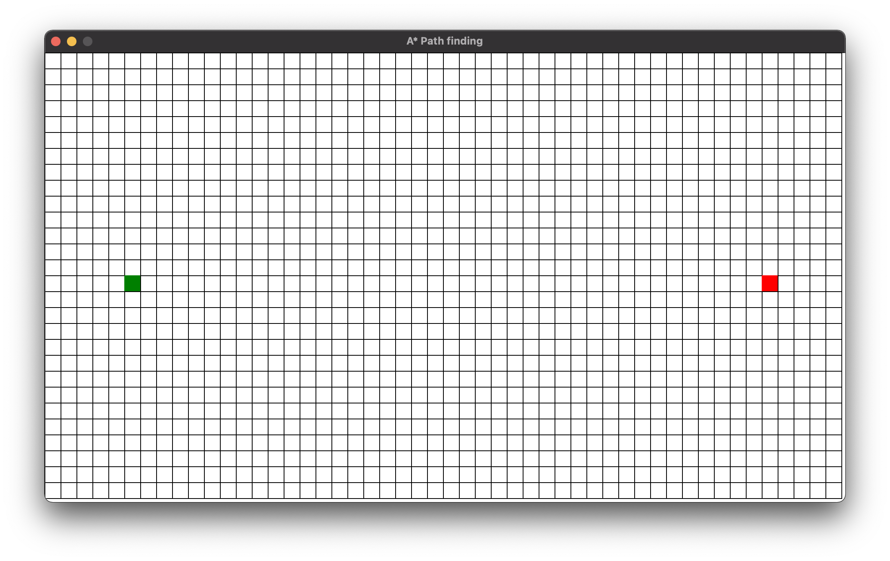

## C# A* PathFInding

This is a pathfinding algorithm written in C# using [Splashkit](https://www.splashkit.io) library.

A screenshot of running application is provided below.

---
### Building this project

**This project requires:**
- [Dontet](https://dotnet.microsoft.com)
- [Git](https://git-scm.com/downloads)
- [Splashkit](https://www.splashkit.io/)
- A code editor, I prefer [VSCode](https://code.visualstudio.com/).
- [MSYS2 Terminal](https://www.msys2.org/), you could use your prefered terminal as well.  (Not required for Mac and Linux user)

**After all above softwares are installed**
- open **MSYS2** terminal
- type the following command to clone to repo: `git clone https://github.com/makara-chhaing/CSharpPathfinding.git`
- type the following command to change to pathfinding directory: `cd CSharpPathfinding`
- run the program with splashkit manager: `skm dotnet run`
- A window as below should poped up

---

## Using this program

- The  Green  square is the start point, you can reposition it by **hovering the cursor over a specific location in the grid** and press **S key** on your keyboard.
- The Red square is the end point, you can reposition it by **hovering the cursor over a specific location in the grid** and press **E key** on your keyboard.
- You can also create a wall by create **wall/walls** between start and end point by **hovering the cursor over a specific location in the grid** and press **w key** on your keyboard.

- Press **Space** to start searching for the shoartest path using A star pathfinding algorithm.

> _**Note:**_ 
> - Ther is no clicking involved in this program.
> - After the program is run, the **yellow path** is the shortest path from start node to end node.
> - The blue area is the area that got searched.
> - After searching the path is visible for 10s before it got cleared.
